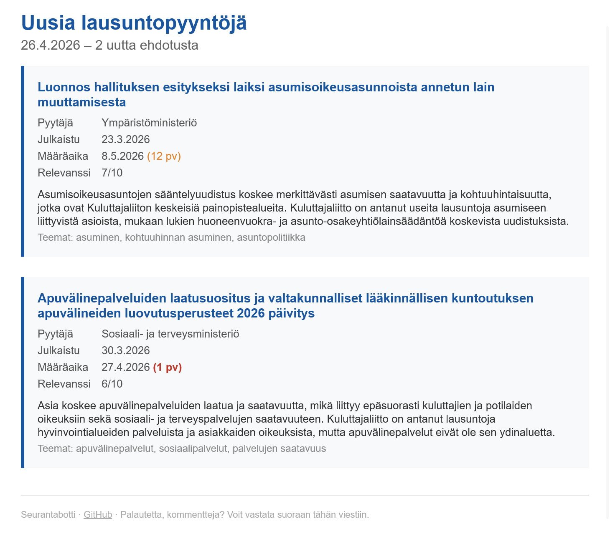

# Lausuntobotti

[](https://github.com/kuosaton/lausuntobotti/actions/workflows/ci.yml) [](https://codecov.io/gh/kuosaton/lausuntobotti) [](https://www.python.org/)
[](https://docs.astral.sh/uv/)

A large language model-based tool to help [Kuluttajaliitto](https://www.kuluttajaliitto.fi/) (The Consumers’ Union of Finland) keep up with [lausuntopalvelu.fi](https://www.lausuntopalvelu.fi), the Finnish public administration's portal for consulting the public on draft proposals and decisions.

Lausuntopalvelu publishes hundreds of new requests for comment (lausuntopyyntö) every month, and manually reviewing them all to spot the ones worth responding to is time-consuming.

Lausuntobotti helps cut through the noise by assessing the relevancy of open requests with [Claude](https://claude.com/product/overview), highlighting the most relevant ones, and bringing the chosen recipient(s) up to speed via email digests.

<p align="center"> </p>

## How it works

The bot is designed to uncover proposals that: (i) are relevant to Kuluttajaliitto and (ii) Kuluttajaliitto has not already been made aware of.

For new proposals, the bot:

1. **Ignores ones with Kuluttajaliitto on the distribution list (jakelulista)**: the requesting organisation has already identified Kuluttajaliitto as a relevant party and will notify them directly.
2. **Ignores ones that Kuluttajaliitto has already responded to.**
3. **Scores their relevancy from 0 to 10.**
4. **Flags high-scoring proposals for review** (score ≥ 6).
5. **Notifies designated recipients** of new flagged proposals via an HTML email digest.

### Data sources

All data comes from publicly accessible sources:

- **[lausuntopalvelu.fi Open API](https://www.lausuntopalvelu.fi/api/v1/Lausuntopalvelu.svc)**: new requests for comment via the public OData/Atom feed; distribution lists and prior responses scraped from each proposal's participation page.
- **[kuluttajaliitto.fi WordPress API](https://www.kuluttajaliitto.fi/wp-json/)**: Kuluttajaliitto's published statements, used as the corpus the scoring model compares new proposals against.

### Relevancy scoring

Each proposal is scored by [Claude Haiku 4.5](https://www.anthropic.com/news/claude-haiku-4-5) based on Kuluttajaliitto's previously published statements and areas of focus. The model is given the following rubric:

| Score | Rubric                                                                                                                                                                               |
| ----- | ------------------------------------------------------------------------------------------------------------------------------------------------------------------------------------ |
| 8-10  | Clearly within Kuluttajaliitto's core mandate: consumer protection, product safety, financial services, housing, or other areas Kuluttajaliitto has repeatedly issued statements on. |
| 5-7   | Concerns consumers indirectly, or grazes Kuluttajaliitto's priorities without being core.                                                                                            |
| 2-4   | Thin connection to consumer matters.                                                                                                                                                 |
| 0-1   | No discernible connection to consumers or Kuluttajaliitto's work.                                                                                                                    |

The bot then acts on the score, printing a tag for each processed proposal:

| Score | Tag                 | Action                                                                           |
| ----- | ------------------- | -------------------------------------------------------------------------------- |
| –     | `SKIP DISTRIBUTION` | Kuluttajaliitto is on the proposal's distribution list (skipped without scoring) |
| –     | `SKIP RESPONDED`    | Kuluttajaliitto has already submitted a response (skipped without scoring)       |
| ≥ 6   | `FLAG x/10`         | Flagged for review, included in the email digest                                 |
| 4-5   | `LOG x/10`          | Logged as potentially interesting (lower confidence), no email                   |
| 0-3   | `DROP x/10`         | Dropped silently                                                                 |

## Usage

### Prerequisites

1. [uv](https://docs.astral.sh/uv/getting-started/installation/) (Python package and project manager)
2. [Python 3.14](https://www.python.org/downloads/) (We recommend [using uv to install and manage Python versions](https://docs.astral.sh/uv/guides/install-python/).)
3. A [Claude Console account](https://platform.claude.com/) & [API key](https://platform.claude.com/settings/keys)
4. **For sending email digests (optional):** a [Resend](https://resend.com/) account, [API key](https://resend.com/docs/dashboard/api-keys/introduction), and a domain ([Resend sends from a domain you own](https://resend.com/docs/dashboard/domains/introduction)). Other functionality works without these.

> [!TIP]
> If you do not have a domain, we recommend [Cloudflare Registrar](https://www.cloudflare.com/products/registrar/) for at-cost domain registrations and renewals without extra fees, and other benefits like free DNS, CDN, and SSL. Resend offers an easy [auto setup process for Cloudflare domains](https://resend.com/docs/knowledge-base/cloudflare#automatic-setup-recommended).

### Setup

Download the [latest release](https://github.com/kuosaton/lausuntobotti/releases/latest), extract it, and `cd` into `lausuntobotti/`. Then:

#### 1. Install the project dependencies

```bash
uv sync               # runtime dependencies only
uv sync --extra dev   # include dev tools (pytest, ruff, pyright, pre-commit)
```

#### 2. Configure the environment

```bash
cp .env.example .env
```

Edit `.env` with your values:

| Variable            | Description                                             |
| ------------------- | ------------------------------------------------------- |
| `ANTHROPIC_API_KEY` | Anthropic API key                                       |
| `RESEND_API_KEY`    | Resend API key for email sending                        |
| `SENDER_EMAIL`      | From address (must be on a domain verified with Resend) |
| `RECIPIENT_EMAIL`   | Comma-separated recipient addresses for digests         |

#### 3. Fetch up-to-date Kuluttajaliitto published statements context (required before first run)

```bash
uv run python main.py --update-context
```

### Using the tool

#### **Option A.** Interactive command-line interface

```bash
uv run python main.py
```

Launches an interactive menu for easy access to all commands. Choose from the listed options:

```text
Lausuntobotti
─────────────────────────────────────
1  Daily check
2  Daily check (dry run)
3  Update Kuluttajaliitto context
4  Review logged items (7 days)
5  Review logged items (custom range)
6  Preview flagged
7  Preview logged (borderline)
8  Send flagged (resend last digest)
9  Reset state
h  Help
0  Exit
─────────────────────────────────────
```

#### **Option B.** Basic command-line interface

```bash
# Daily check – score new proposals and send the digest if any clear the threshold
uv run python main.py --daily
uv run python main.py --daily --dry-run    # score and log, but don't send

# Full list of commands (refresh context, preview/resend digests, review borderline, reset state)
uv run python main.py --help
```

## Planned features

**Parliamentary committee analysis (`--weekly`, `--midweek`).** Kuluttajaliitto also needs to track proceedings in relevant parliamentary committees (talousvaliokunta, sosiaali- ja terveysvaliokunta). The planned commands would score new committee items using the same model and deliver them in a weekly digest.

## Development

```bash
# Canonical quality gate (same command used in CI)
make check

# Fast local smoke checks
make quick-test

# Optional: run configured hooks across all files
make precommit

# One-time install for git hooks (pre-commit + pre-push)
make precommit-install

# Mutation testing (heavier quality signal)
make mutation
make mutation-results
```

### State files

All state lives under `state/`:

| File                  | Contents                                    |
| --------------------- | ------------------------------------------- |
| `seen_proposals.json` | Proposals already processed (deduplication) |
| `score_log.jsonl`     | Full scoring history                        |
| `nostetut.json`       | Items that crossed the notify threshold     |
| `seen_documents.json` | Reserved for document-level deduplication   |

### About the development process

This project was built as a rapid prototype with [Claude Code](https://claude.ai/code) as the primary coding agent. The human developer defined requirements in collaboration with the client, made architectural and scoping decisions, reviewed all changes, and managed version control. Toolchain choices were also human-led: the move to uv and ruff, pinning dependencies with a 7-day expiry on new releases to limit supply chain exposure, and hardening GitHub Actions.
