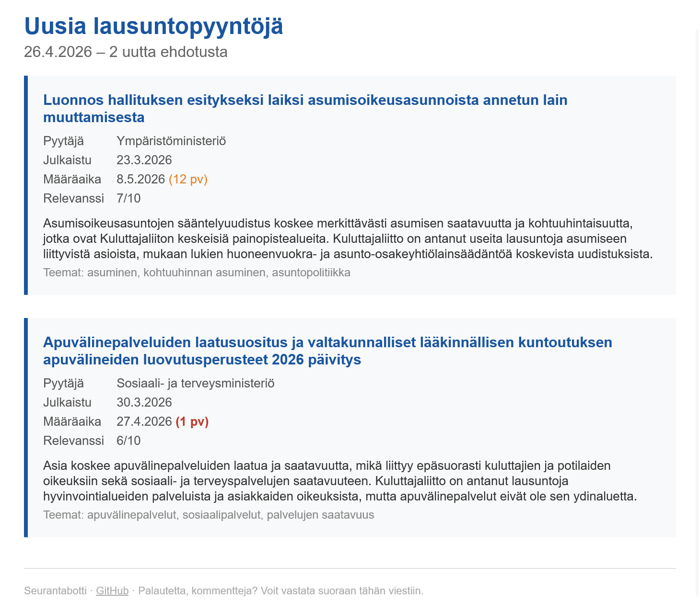

# Lausuntobotti

[](https://github.com/kuosaton/lausuntobotti/actions/workflows/ci.yml) [](https://codecov.io/gh/kuosaton/lausuntobotti) [](https://www.python.org/)
[](https://docs.astral.sh/uv/)

Lausuntobotti is an LLM-based monitoring tool that helps [Kuluttajaliitto](https://www.kuluttajaliitto.fi/) keep up with new public consultation requests and parliamentary committee agendas. It uses [Claude](https://claude.com/product/overview) to surface relevant items from [lausuntopalvelu.fi](https://www.lausuntopalvelu.fi) and Eduskunta committee proceedings, then sends email digests to the chosen recipients.

<p align="center"> </p>

## How it works

The bot is designed to uncover public policy items that are relevant to Kuluttajaliitto and may otherwise be easy to miss.

It monitors two public sources:

- **lausuntopalvelu.fi proposals**: skips proposals where Kuluttajaliitto is already on the distribution list or has already responded.
- **Eduskunta committee agendas**: reviews each agenda matter, skipping matters where Kuluttajaliitto has already been heard as an expert.

For the remaining items, the bot:

1. Scores relevance from 0 to 10 with Claude.
2. Flags high-scoring items for the email digest.
3. Logs borderline items for review.
4. Drops low-scoring items.

### Relevancy scoring

Each item is scored by Claude based on Kuluttajaliitto's previously published statements and areas of focus.

| Score | Meaning                                                                                                                     | Action                       |
| ----- | --------------------------------------------------------------------------------------------------------------------------- | ---------------------------- |
| 8-10  | Clearly within Kuluttajaliitto's core mandate, such as consumer protection, product safety, financial services, or housing. | `FLAG` and include in digest |
| 6-7   | Relevant or adjacent to Kuluttajaliitto's priorities.                                                                       | `FLAG` and include in digest |
| 4-5   | Borderline relevance.                                                                                                       | `LOG` only                   |
| 2-3   | Thin connection to consumer matters.                                                                                        | `DROP`                       |
| 0-1   | No clear connection to consumers or Kuluttajaliitto's work.                                                                 | `DROP`                       |

### Data sources

All data comes from publicly accessible sources:

- [lausuntopalvelu.fi Open API](https://www.lausuntopalvelu.fi/api/v1/Lausuntopalvelu.svc): new requests for comment via the public OData/Atom feed; distribution lists and prior responses scraped from each proposal's participation page.
- [kuluttajaliitto.fi WordPress API](https://www.kuluttajaliitto.fi/wp-json/): Kuluttajaliitto's published statements, used as the corpus the scoring model compares new proposals against.
- [eduskunta.fi](https://www.eduskunta.fi/) and [avoindata.eduskunta.fi](https://avoindata.eduskunta.fi/): committee pages and VaskiData XML for parliamentary committee agendas.

## Usage

Prerequisites:

- [uv](https://docs.astral.sh/uv/getting-started/installation/)
- [Python 3.14](https://docs.astral.sh/uv/guides/install-python/) (uv can use an existing installation or automatically install one if missing)

### Setup

Download the [latest release](https://github.com/kuosaton/lausuntobotti/releases/latest), extract the compressed files, and navigate into the directory root. Then:

#### 1. Configure the environment

```bash
cp .env.example .env
```

Edit `.env` with your values:

| Variable            | Description                                               |
| ------------------- | --------------------------------------------------------- |
| `ANTHROPIC_API_KEY` | Anthropic API key                                         |
| `RESEND_API_KEY`    | Resend API key for email sending                          |
| `SENDER_EMAIL`      | Sender address (must be on a domain verified with Resend) |
| `RECIPIENT_EMAIL`   | Comma-separated recipient addresses for digests           |

#### 2. Use the tool

Run the interactive CLI:

```bash
uv run main.py
```

Use `h` in the menu for options.

Direct commands are listed with:

```bash
uv run python main.py --help
```

`uv run` works without activating a virtual environment. If you prefer an activated shell, run `uv sync` first, activate `.venv`, and then use commands without the `uv run` prefix.

### Valiokunta Analysis

`--valiokunta` tracks new agendas from Talousvaliokunta, Maa- ja metsätalousvaliokunta, and Ympäristövaliokunta. It extracts scheduled matters from VaskiData XML, scores them with the same Kuluttajaliitto context, and sends one committee digest grouped by valiokunta. Digest sections are ordered with Talousvaliokunta first, then Maa- ja metsätalousvaliokunta, then Ympäristövaliokunta.

Use `--resend-valiokunta-digest` to resend the valiokunta digest from recent score-log entries without re-running scoring. Use `--valiokunta --dry-run` or `--resend-valiokunta-digest --dry-run` to preview a fresh or reconstructed run.

## Development

Install development dependencies using `uv sync --extra dev`.

```bash
# Format project Python files
uv run ruff format .

# Check formatting without making changes
make format

# Lint
make lint

# Type checking
make typecheck

# Tests
make test

# Combined checks (format + lint + typecheck + test), used in CI
make check

# Mutation testing (heavier quality signal)
make mutation

# One-time install for git hooks (pre-commit, pre-push)
make precommit-install
```

### State files

All state lives under `state/`:

| File                         | Contents                                    |
| ---------------------------- | ------------------------------------------- |
| `seen_proposals.json`        | Proposals already processed (deduplication) |
| `score_log.jsonl`            | Lausuntopyyntö scoring history              |
| `valiokunta_score_log.jsonl` | Valiokunta scoring history                  |
| `nostetut.json`              | Items that crossed the flag threshold       |
| `seen_documents.json`        | Committee agenda deduplication              |

### Model configuration (optional)

Built-in defaults work without a config file. To customize them locally, copy
[`model_config.example.toml`](model_config.example.toml) to `model_config.toml`. Edit this file to try another [Claude model](https://platform.claude.com/docs/en/about-claude/models/overview):

- [Sonnet 4.6](https://www.anthropic.com/news/claude-sonnet-4-6) is the default model for a balance of speed and intelligence.

- [Haiku 4.5](https://www.anthropic.com/news/claude-haiku-4-5) can be explored for cost savings. In our experiments, we found it struggled with ambiguous or borderline items.

[effort](https://platform.claude.com/docs/en/build-with-claude/effort), max_tokens, timeout, and [prompt cache](https://platform.claude.com/docs/en/build-with-claude/prompt-caching) settings are tuning knobs, not required setup. Keep caching enabled unless you have a particular reason to disable it.

For deployment-specific overrides, use the optional `CLAUDE_SCORING_*` environment variables shown in `.env.example`; environment variables take precedence over `model_config.toml`.

### System prompt

The scoring rubric and mission framing live in `SYSTEM_PROMPT` in [`processing/llm_scorer.py`](processing/llm_scorer.py). You can edit it to tune what the bot treats as relevant, but compare changes against historical `score_log.jsonl` examples before using them in production; prompt changes affect which items appear in digests.
